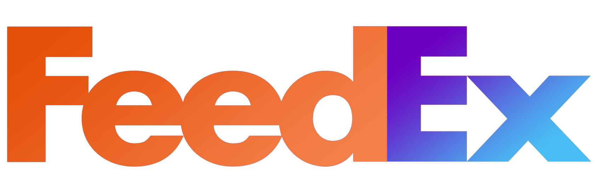

<div id="top"></div>
<!--
*** Thanks for checking out the Best-README-Template. If you have a suggestion
*** that would make this better, please fork the repo and create a pull request
*** or simply open an issue with the tag "enhancement".
*** Don't forget to give the project a star!
*** Thanks again! Now go create something AMAZING! :D
-->


<!-- PROJECT SHIELDS -->
<!--
*** I'm using markdown "reference style" links for readability.
*** Reference links are enclosed in brackets [ ] instead of parentheses ( ).
*** See the bottom of this document for the declaration of the reference variables
*** for contributors-url, forks-url, etc. This is an optional, concise syntax you may use.
*** https://www.markdownguide.org/basic-syntax/#reference-style-links
-->
[![Contributors][contributors-shield]][contributors-url]
[![Forks][forks-shield]][forks-url]
[![Issues][issues-shield]][issues-url]
[![MIT License][license-shield]][license-url]
[![LinkedIn][linkedin-shield]][linkedin-url]


<!-- PROJECT LOGO -->
<br />
<div align="center">
  <a href="https://github.com/matbmoser/gestor-muelles-feedex">
    
  </a>

<h3 align="center">FeedEx Dock Management System</h3>

  <p align="center">
    Project made for IT Project Management class, where a functional dock management web system was developed.
    <br />
    <a href="https://github.com/matbmoser/gestor-muelles-feedex"><strong>Explore the docs »</strong></a>
    <br />
    <br />
    <a href="https://github.com/matbmoser/gestor-muelles-feedex">View Demo</a>
    ·
    <a href="https://github.com/matbmoser/gestor-muelles-feedex/issues">Report Bug</a>
    ·
    <a href="https://github.com/matbmoser/gestor-muelles-feedex/issues">Request Feature</a>
  </p>
</div>


<!-- TABLE OF CONTENTS -->
<details>
  <summary>Table of Contents</summary>
  <ol>
    <li>
      <a href="#about-the-project">About The Project</a>
      <ul>
        <li><a href="#built-with">Built With</a></li>
      </ul>
    </li>
    <li>
      <a href="#getting-started">Getting Started</a>
      <ul>
        <li><a href="#prerequisites">Prerequisites</a></li>
        <li><a href="#installation">Installation</a></li>
      </ul>
    </li>
    <li><a href="#license">License</a></li>
    <li><a href="#contact">Contact</a></li>
    <li><a href="#acknowledgments">Acknowledgments</a></li>
  </ol>
</details>


<!-- ABOUT THE PROJECT -->
## About The Project
### Tranporter View

[![Product Name Screen Shot][product-screenshot]]()

### Manager View

[![Product Name Screen Shot][product-screenshot2]]()

<p align="right">(<a href="#top">back to top</a>)</p>


### Built With

* [Bootstrap](https://getbootstrap.com)
* [JQuery](https://jquery.com)

<p align="right">(<a href="#top">back to top</a>)</p>


<!-- GETTING STARTED -->
## Getting Started

This is an example of how you may give instructions on setting up your project locally.
To get a local copy up and running follow these simple example steps.

### Prerequisites

1. Install APACHE or XAMPP with MySQL and PHP
   ```
   https://www.apachefriends.org/es/index.html

2. Execute db sql script `media/data/GestionMuelles.sql` in MySQL Database

### Installation

1. Clone the repo
   ```sh
   git clone https://github.com/matbmoser/gestor-muelles-feedex.git
   ```

   ```
2. Config database setup in `assets/mod/db.config.php`
   ```
   return array (
    "host"    => "localhost or <hostname>",
    "user"    => "<username>",
    "pass"    => "<password>",
    "name"    => "sgm", <database name> using sql script creates "sgm" database
    "port"    => <port>
   ```

<p align="right">(<a href="#top">back to top</a>)</p>


<!-- USAGE EXAMPLES -->
## Usage

1. Open localhost and register into the app.

_For more examples, please refer to the [Documentation](https://example.com)_

<p align="right">(<a href="#top">back to top</a>)</p>


## Project Management
This project was managed following the ESA Software Engineering Standards.
All the documentation built throught the project is uploaded to the `/docs`.

There you will find all the deliverables, which follow the guidelines stablished in the *European Space Agency Standard Lifecycle*:  


Reference [Figure 4.1]: http://microelectronics.esa.int/vhdl/pss/PSS-05-0.pdf#page=93

> **_NOTE:_**  All the documentation is in `spanish` since the project was for a class in a spanish University (Universidad Francisco de Vitoria)


<!-- LICENSE -->
## License

Distributed under the MIT License. See `LICENSE.md` for more information.

<p align="right">(<a href="#top">back to top</a>)</p>


<!-- CONTACT -->
## Contact

Mathias Brunkow Moser - matbmoser@gmail.com

Project Link: [https://github.com/matbmoser/dock-management-system](https://github.com/matbmoser/dock-management-system)

<p align="right">(<a href="#top">back to top</a>)</p>


## Clarifications
The FeedEx logo and name were based in the company FedEx. As students one of our requirements for the project was to create a fake name and logo based in a real logistic company, in order to simulate and aproximate to the real necesity of a Dock Management System.

There was no intention of defaming the company or to copy its identity in order to speak in its name, and all the project was developed within educational environment, so there was never a intention of selling the product or sharing with third-parties.


<!-- MARKDOWN LINKS & IMAGES -->
<!-- https://www.markdownguide.org/basic-syntax/#reference-style-links -->
[contributors-shield]: https://img.shields.io/github/contributors/matbmoser/dock-management-system.svg?style=for-the-badge
[contributors-url]: https://github.com/matbmoser/dock-management-system/graphs/contributors
[forks-shield]: https://img.shields.io/github/forks/matbmoser/dock-management-system.svg?style=for-the-badge
[forks-url]: https://github.com/matbmoser/dock-management-system/network/members
[stars-shield]: https://img.shields.io/github/stars/matbmoser/dock-management-system.svg?style=for-the-badge
[stars-url]: https://github.com/matbmoser/dock-management-system/stargazers
[issues-shield]: https://img.shields.io/github/issues/matbmoser/dock-management-system.svg?style=for-the-badge
[issues-url]: https://github.com/matbmoser/dock-management-system/issues
[license-shield]: https://img.shields.io/github/license/matbmoser/dock-management-system.svg?style=for-the-badge
[license-url]: https://github.com/matbmoser/dock-management-system/blob/master/LICENSE.md
[linkedin-shield]: https://img.shields.io/badge/-LinkedIn-black.svg?style=for-the-badge&logo=linkedin&colorB=555
[linkedin-url]: https://linkedin.com/in/mathias-brunkow-moser
[product-screenshot]: images/screenshot.png
[product-screenshot2]: images/screenshot2.png
